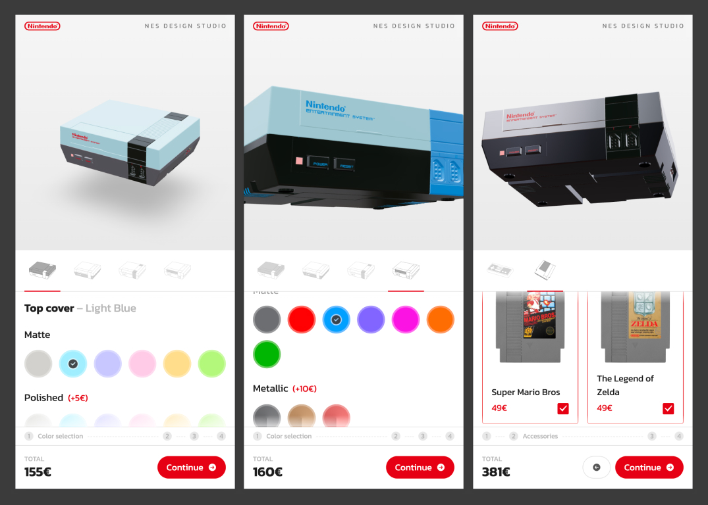

# NES Design Studio

3D Configurator for the Nintendo Entertainment System.

[View demo](https://nds.lou-va.com/)



## About

I built this project to experiment with 3D and the three.js library and how it could be used to improve UX in an online shop with product personalisation.

*All trademarks belong to Nintendo™ and is used solely for educational purposes.*

## Built with

- [React](https://react.dev/)
- [Three.js](https://threejs.org/)
- [React Three Fiber](https://docs.pmnd.rs/react-three-fiber/getting-started/introduction)
- [React Three Drei](https://dext.vercel.app/drei/introduction)
- [Zustand](https://docs.pmnd.rs/zustand/getting-started/introduction)
- [Tailwind](https://tailwindcss.com/)


## Getting Started

### ⚙️ Prerequisites

Ensure you have `Node.js` and `npm` installed on your machine to run this project locally.

### 💾 Installation

#### 1. Clone the Repository
```sh
git clone git@github.com:louis-va/nes-design-studio.git
```

#### 2. Install dependencies
```sh
cd nes-design-studio/
npm install
```

### 🚀 Execution

#### Run the app locally
```sh
npm run dev
```

### 🚚 Production

#### Build and Run
```sh
npm run build
npm run start
```

## Acknowledgments

- Credits to [3dblendheat](https://www.instagram.com/3dblendheat/) for the 3d model
- Credits to [NintendoLife](https://www.nintendolife.com/games/browse?system=nes) for the NES Games Pictures
